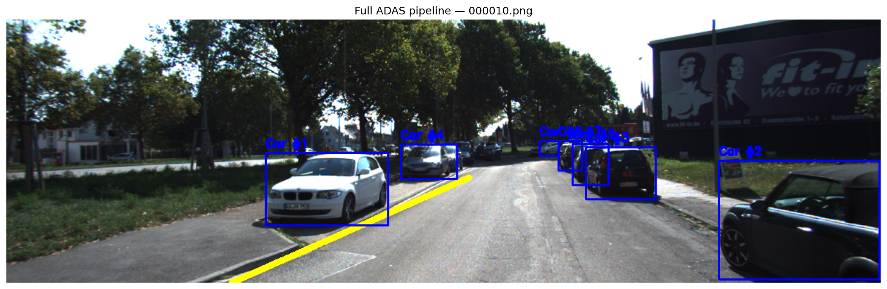

# Multi-Object Detection & Tracking for ADAS

End-to-end perception stack for advanced driver-assistance and autonomous-driving prototyping: **YOLOv8** detects cars, pedestrians, and cyclists (aligned with KITTI-style labels), **DeepSORT** maintains stable track IDs across frames, and **OpenCV** lane detection overlays drivable corridor hints. A **FastAPI** service exposes image, video, and live-stream inference for integration tests and demos.

## Features

| Component | Technology | Role |
|-----------|------------|------|
| Detection | Ultralytics YOLOv8 | COCO → KITTI class mapping (car, pedestrian, cyclist) |
| Tracking | deep-sort-realtime | Appearance + motion association |
| Lanes | OpenCV Canny + Hough | ROI-based lane line estimation |
| API | FastAPI + Uvicorn | REST + MJPEG streaming |
| Dataset | KITTI Object (optional) | Training/evaluation imagery under `data/` |

## Project layout

```
multi-object-tracking-adas/
├── app/
│   ├── main.py           # FastAPI + VideoPipeline
│   ├── detector.py       # YOLOv8 wrapper
│   ├── tracker.py        # DeepSORT wrapper
│   └── lane_detector.py  # Lane detection
├── data/                 # KITTI (gitignored)
├── models/               # Weights (gitignored)
├── notebooks/            # Dataset exploration
├── tests/
├── Dockerfile
└── requirements.txt
```

## Requirements

- Python 3.10+ (3.11 recommended)
- Windows, Linux, or macOS
- Optional: NVIDIA GPU + CUDA for faster YOLO/DeepSORT embedder (`EMBEDDER_GPU=1`)

## Setup

### 1. Clone and virtual environment

```bash
cd multi-object-tracking-adas
python -m venv .venv

# Windows
.venv\Scripts\activate

# Linux / macOS
source .venv/bin/activate

pip install -r requirements.txt
```

### 2. KITTI dataset (optional, for training/eval)

1. Register at [KITTI Vision Benchmark](http://www.cvlibs.net/datasets/kitti/).
2. Download **Object Detection** left color images and labels.
3. Extract under `data/kitti/`:

```
data/kitti/
├── training/
│   ├── image_2/    # *.png
│   └── label_2/    # *.txt
└── testing/
    └── image_2/
```

Paths use `os.path` throughout; on Windows use the same folder names.

### 3. Model weights

On first run, Ultralytics downloads `yolov8n.pt` automatically. To store weights locally:

```bash
# Copy or download into models/
# models/yolov8n.pt
```

Or set a custom path:

```bash
set YOLO_MODEL_PATH=models\yolov8s.pt
```

### 4. Run the API

```bash
uvicorn app.main:app --reload --host 0.0.0.0 --port 8000
```

Open [http://127.0.0.1:8000/docs](http://127.0.0.1:8000/docs) for interactive Swagger UI.

### 5. Docker

```bash
docker build -t mot-adas .
docker run -p 8000:8000 -v "%cd%\data:/app/data" mot-adas
```

Mount `data/` to stream KITTI sequences via `/stream/video?path=...`.

## API endpoints

| Method | Path | Description |
|--------|------|-------------|
| GET | `/health` | Service status |
| POST | `/inference/image` | Upload image → tracks + base64 annotated frame |
| POST | `/inference/frame` | JSON body with `image_b64` |
| POST | `/inference/video` | Upload video → annotated MP4 (base64) + FPS stats |
| GET | `/stream/camera?device_id=0` | MJPEG from webcam |
| GET | `/stream/video?path=data/kitti/...` | MJPEG from file under `data/` |

Example (image upload with curl):

```bash
curl -X POST "http://127.0.0.1:8000/inference/image" ^
  -H "accept: application/json" ^
  -H "Content-Type: multipart/form-data" ^
  -F "file=@data/kitti/training/image_2/000000.png"
```

## Real-time pipeline

`VideoPipeline` in `app/main.py` chains:

1. `ObjectDetector.detect()` — filtered YOLO boxes  
2. `ObjectTracker.update()` — DeepSORT track IDs  
3. `LaneDetector.detect()` + `draw_lanes()` — green lane overlays  

Reset tracker state between sequences with `tracker.reset()`.

## Environment variables

| Variable | Default | Purpose |
|----------|---------|---------|
| `YOLO_MODEL_PATH` | `models/yolov8n.pt` or hub name | Detector weights |
| `EMBEDDER_GPU` | `0` | Use GPU for DeepSORT MobileNet embedder |
| `API_HOST` / `API_PORT` | `0.0.0.0` / `8000` | Uvicorn bind |

## Tests

```bash
pytest tests/ -v
```

Detector tests mock Ultralytics so CI does not download weights.

## Notebook

`notebooks/01_explore_kitti.ipynb` walks through KITTI layout, label parsing, and a sample detection overlay.

## Results

Evaluated on KITTI training images (`1242×375`) with `yolov8n.pt` and the exploration notebook (`notebooks/01_explore_kitti.ipynb`).

### Detection (YOLOv8n, conf=0.35)

| Image | Cars | Pedestrians | Cyclists |
|-------|------|-------------|----------|
| 000001 | 1 | 0 | 0 |
| 000010 | 7 | 0 | 0 |
| 000050 | 4 | 0 | 0 |
| 000100 | 0 | 2 | 0 |

### Tracking (DeepSORT)

- 23 unique track IDs across 10 frames (`000000`–`000009`)
- 2.30 average detections per frame
- Color-stable IDs within each frame

Note: KITTI object-detection image indices are not consecutive video frames, so cross-frame ID persistence is limited unless you use frames from a single raw sequence.

### Lane Detection (OpenCV Hough)

- Detected on clear road images (e.g. `000010` — 1 lane line)
- ROI-based Canny + Hough; works best on highway-style scenes with visible lane markings
- `000050` / `000100`: 0 lines detected (weaker markings in ROI)

### Full Pipeline

- 7 cars tracked + 1 lane line on `000010.png`
- All three modules chained: **detect → track → lanes**

## Sample Output

Full ADAS pipeline on KITTI `000010.png` (YOLOv8 + DeepSORT + lane overlay):



## License

Use KITTI and Ultralytics weights according to their respective licenses. This repository code is provided for research and education.

## References

- [Ultralytics YOLOv8](https://github.com/ultralytics/ultralytics)
- [deep-sort-realtime](https://github.com/levan92/deep_sort_realtime)
- [KITTI Dataset](http://www.cvlibs.net/datasets/kitti/)
